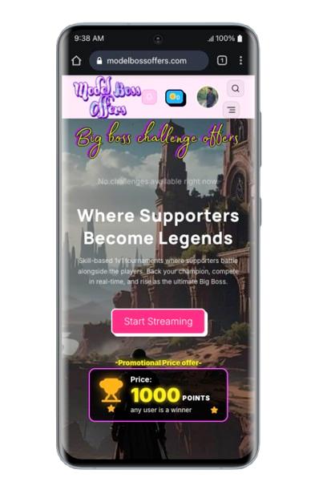
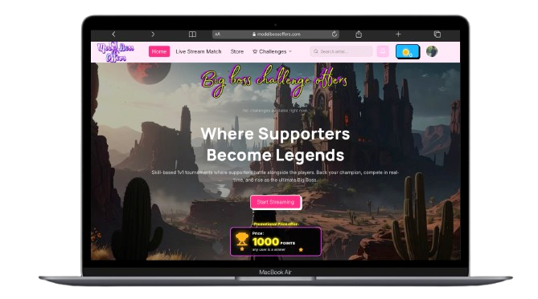
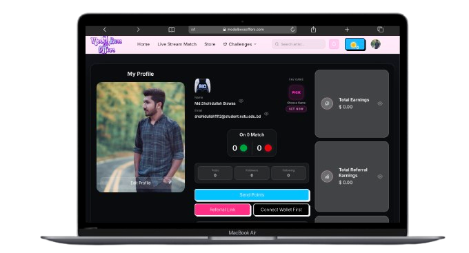

<div align="center">


# Model Boss Offers

**A production-grade, competitive live-gaming platform for 1v1 tournaments, real-time supporter battles, featured gaming matches, and point-based player support.**

Built with Next.js 16 (App Router), Redux Toolkit, Laravel Echo (Reverb WebSockets), and Tailwind CSS v4 — uniting a public tournament discovery hub, an OTP-secured player experience, and a comprehensive super-admin console in one cohesive web application.

</div>

---

## Table of Contents

- [Overview](#overview)
- [Key Features](#-key-features)
- [Tech Stack](#-tech-stack)
- [Project Structure](#-project-structure)
- [Getting Started](#-getting-started)
- [Environment Variables](#-environment-variables)
- [Available Scripts](#-available-scripts)
- [Roles & Access](#-roles--access)
- [Feature Areas](#-feature-areas)
- [Real-Time Notifications](#-real-time-notifications)
- [Authentication & Security](#-authentication--security)
- [SEO & Link Sharing](#-seo--link-sharing)
- [Production Deployment](#-production-deployment)
- [Contributing](#-contributing)
- [License](#-license)

---

## Overview

The **Model Boss Offers** platform is a competitive, skill-based tournament and entertainment ecosystem where players face off in live 1v1 matches while supporters back their favorites with virtual points. All competition is determined purely by player skill — not real-money betting or wagering — and rewards are distributed through supporter contributions within a structured, secure, and transparent environment.

The frontend is fully integrated with the Model Boss REST API through a typed RTK Query layer, streams live match action with **Mux Player**, and consumes real-time events over **Reverb WebSockets** (Laravel Echo + Pusher protocol). Authentication is OTP-verified and optionally social, sessions are cookie-based, and the entire route tree is guarded by role-aware middleware.

| Audience | Workspace | Description |
| --- | --- | --- |
| **Visitors** | `/`, `/live-stream`, `/point-store`, `/challenge-dashboard` | Browse tournaments, watch live streams, discover games & artists, read news, and buy support points. |
| **Players / Supporters** (`user` / `artist`) | `/live-stream/match/**`, `/user-profile`, `/challenge-dashboard/**`, … | Watch live matches, back players with points, create & accept 1v1 challenges, manage profile, notifications, transactions, and support history. |
| **Platform Administrators** (`super_admin`) | `/admin/dashboard` | Operate the full console — match, user, challenge, withdrawal & voting management, gallery/news/legal CMS, and payment-provider credential settings. |

> **⚖️ Fair-play notice** — Model Boss Offers is an entertainment platform built on player skill and virtual points. It is **not** a real-money betting or wagering product.

---

## 📸 Screenshots

> 👉 Add your screenshots here — drop images into `public/screenshots/` and reference them below (or share them with the maintainer to embed).

| login | 
| --- | --- |
|  

|Home | Profile |
| --- | --- |
|  |  |
## ✨ Key Features

- **🏆 1v1 challenge hub** (`/challenge-dashboard`)
  - Create challenge offers with rules, stakes, and winner rewards; browse open offers, accept incoming challenges, and track accepted / received / completed queues.
  - Real-time readiness flow between both players over private WebSocket channels — rules modal, opponent-ready prompts, and delayed cache invalidation after challenge events.

- **📺 Live matches & supporter battles**
  - Mux Player–powered live match pages with supporter grids, per-side point tracking, match point summaries, and live 1v1 battle context. Global live status is broadcast over the `live-status-updates` channel (`.status.changed`) and reflects across the whole app.

- **🏅 Match voting & supporter ranking**
  - Live voting on featured matches with real-time `.voting.started`, `.vote.placed`, `.voting.updated`, and `.match.vote.updated` events, top-voter leaderboards, and point-based supporter rankings on public and profile screens.

- **💰 Point economy & multi-gateway payments**
  - Point store with **Stripe**, **PayPal**, **BitPay**, **MonCash**, and **NatCash** payment flows, transaction history, withdrawal requests, and dedicated `payment-success` / `payment-cancel` confirmation pages.

- **👤 Profiles, artists & the social graph**
  - Rich user and artist profiles with bio editing, user posts, favorite-game selection, profile visibility controls, and follower/following lists on artist detail pages.

- **🔔 Real-time notifications**
  - Global notification center hydrated from API and kept live over private `user.{id}` / `App.Models.User.{id}` channels — challenge created/completed, coins received, and challenge won / lost toasts, all with coalesced event handling.

- **🔐 Secure, role-aware authentication**
  - Email + password with **OTP verification**, forgot / reset password flows, **Google / Facebook / Apple** social sign-in, cookie-based sessions (`token`, `role`, `refresh_token`, `admin_token`, …), proactive silent token refresh, and single-flight `401` re-auth with graceful re-login on expired sessions.

- **🛠 Production admin console** (`/admin/dashboard`)
  - KPI dashboard with earnings analytics charts and live controls, match / game / category / user / challenge / withdrawal / voting management, gallery & news CMS, promotional settings, legal-page editor (privacy policy, terms & conditions), and a payment-provider credential vault (Stripe, PayPal, MonCash, BitPay, Twitch, Facebook, SMTP).

- **🔎 SEO & rich link previews**
  - Type-safe metadata factory, JSON-LD structured data, `robots.txt` + `sitemap.xml`, and server-generated OG images (`@vercel/og`) — with a middleware crawler bypass so match and challenge links preview correctly on social platforms.

- **🧭 Guided UX**
  - Smooth-scroll (Lenis), animated carousels (Embla / Slick), sonner toasts, and responsive mobile navigation with route-aware public navbar states.

---

## 🧰 Tech Stack

| Layer | Technology |
| --- | --- |
| **Framework** | [Next.js 16](https://nextjs.org) (App Router, React Server Components, `src/proxy.ts` middleware) |
| **UI Library** | [React 19](https://react.dev) + TypeScript 5 (strict mode) |
| **Styling** | [Tailwind CSS v4](https://tailwindcss.com) + `tw-animate-css`, CSS-variable design tokens |
| **State & Data** | [Redux Toolkit](https://redux-toolkit.js.org) + [RTK Query](https://redux-toolkit.js.org/rtk-query/overview) + React Redux + `redux-persist` |
| **Real-time** | [Laravel Echo](https://laravel.com/docs/broadcasting) + [Pusher.js](https://pusher.com) over Reverb (WSS) |
| **Live Video** | [Mux Player](https://www.mux.com/player) (`@mux/mux-player-react`) |
| **Components** | Radix UI primitives (Dialog, Dropdown, Select, Slot) + `components.json` (shadcn/ui) |
| **Forms** | React Hook Form, Zod validation, OTP code input group |
| **Charts** | Chart.js + react-chartjs-2 |
| **Carousels** | Embla Carousel, react-slick + slick-carousel |
| **Rich Text** | react-quill-new (news, legal-page CMS) |
| **Icons** | Lucide React, React Icons |
| **Motion / UX** | Lenis smooth scroll, sonner toasts, `next/font` (Inter + Manrope) |
| **Auth** | js-cookie, OAuth callbacks (Google / Facebook / Apple), OTP verification |
| **SEO** | `@vercel/og`, JSON-LD structured data, `robots.ts` + `sitemap.ts` |
| **Utilities** | clsx, tailwind-merge, class-variance-authority |
| **Deployment** | Standard Node / Vercel hosting |

---

## 📁 Project Structure

```text
model-boss-offers/
├── public/                      # Static assets (brand logo, hero images, payment marks)
│   ├── images/home/             # Homepage imagery, banners, category overlays
│   └── payments/                # Stripe, PayPal, BitPay, MonCash, NatCash marks
├── src/
│   ├── app/                     # Next.js App Router
│   │   ├── (public)/            # Home, /live-stream, /point-store, /challenge-dashboard, /terms, /privacy-policy
│   │   ├── (auth)/              # /login (+OTP verify), /register, /forgot-password (+verify, +reset)
│   │   ├── (user)/              # Live match watch, user-profile, artist, notifications, transactions, support-history, payment results
│   │   ├── (admin)/             # /admin login + /admin/dashboard/** (super-admin console)
│   │   ├── google|facebook|apple/callback/  # Social OAuth callback routes (+ connected/failed pages)
│   │   ├── robots.ts / sitemap.ts           # Crawler directives & sitemaps
│   │   └── layout.tsx           # Root layout (fonts, providers, toaster, route gate)
│   ├── components/ui/           # Radix-based UI primitives (button, dialog, select, …)
│   ├── constant/                # API base URL + socket configuration
│   ├── features/                # Feature-scoped modules (e.g. challenge-match)
│   ├── lib/                     # Helpers & shared utilities
│   ├── proxy.ts                 # Auth-aware middleware (route protection, crawler bypass)
│   ├── redux/                   # Store, baseApi (401 re-auth), RTK Query feature modules, slices
│   ├── shared/                  # Providers (realtime/notification/live-status/voting), UI, lib (auth, echo), SEO
│   └── types/                   # Typed domain contracts (auth, match, challenge, support, …)
├── next.config.ts               # Image remote allow-list, AVIF/WebP formats, React strict mode
├── tsconfig.json                # Strict TypeScript configuration with `@/*` path aliases
└── package.json
```

---

## 🚀 Getting Started

### Prerequisites

- **Node.js 20+** (Node 22 recommended)
- **npm** (or your package manager of choice)
- A running **Model Boss REST API** backend + **Reverb WebSocket** server for real-time features

### 1. Install dependencies

```bash
npm install
```

### 2. Configure environment

```bash
cp .env.example .env.local
```

Fill in the variables documented in the [Environment Variables](#-environment-variables) section.

### 3. Start the development server

```bash
npm run dev
```

Open [http://localhost:3000](http://localhost:3000) — visitors land on the marketing home; unauthenticated access to protected routes redirects to `/login` (or `/admin` for the admin console).

---

## 🌱 Environment Variables

All configuration lives in the repo root `.env.local` and is read from `process.env`. `NEXT_PUBLIC_*` values are **inlined at build time** — provide them both for `npm run build` and in your hosting environment.

```bash
# API
NEXT_PUBLIC_API_URL=https://app.example.com/api

# Realtime (Reverb / Laravel Echo + Pusher protocol)
NEXT_PUBLIC_REVERB_APP_KEY=your-reverb-application-key
NEXT_PUBLIC_REVERB_HOST=app.example.com
NEXT_PUBLIC_REVERB_PORT=
NEXT_PUBLIC_REVERB_SCHEME=https

# Optional
NEXT_PUBLIC_SOCKET_URL=https://app.example.com/api
NEXT_PUBLIC_SITE_URL=https://example.com
```

| Variable | Required | Description |
| --- | --- | --- |
| `NEXT_PUBLIC_API_URL` | ✅ | Base URL of the Model Boss REST API, e.g. `https://app.example.com/api`. |
| `NEXT_PUBLIC_REVERB_APP_KEY` | ✅* | Reverb application key for real-time events (Laravel Echo / Pusher protocol). |
| `NEXT_PUBLIC_REVERB_HOST` | ✅* | Reverb WebSocket host, e.g. `app.example.com`. |
| `NEXT_PUBLIC_REVERB_PORT` | ✅* | WebSocket port — `443` for WSS. |
| `NEXT_PUBLIC_REVERB_SCHEME` | ✅* | `https` / `wss` connection scheme. |
| `NEXT_PUBLIC_SOCKET_URL` | ❌ | Broadcasting/auth endpoint fallback (defaults to the API URL). |
| `NEXT_PUBLIC_SITE_URL` | ❌ | Public origin for canonical URLs and sitemaps (defaults to `https://example.com`). |

> \* Required for live/socket-driven features. Never commit real credentials — keep `.env.local` local.

---

## 📜 Available Scripts

| Command | Description |
| --- | --- |
| `npm run dev` | Start the development server with hot reload. |
| `npm run build` | Create an optimized production build. |
| `npm run start` | Serve the production build locally. |
| `npm run lint` | Run ESLint across the codebase (Next.js core-web-vitals + TypeScript). |

---

## 👥 Roles & Access

Access is enforced in two layers — the Next.js middleware (`src/proxy.ts`) and client-side route gates (`RouteGate` / `RouteProvider`). Sessions are cookie-based: player sessions use `token` + `role` + `refresh_token`; admin sessions use `admin_token` + `admin_role` + `admin_refresh_token`.

| Route | Middleware rule | Who can access |
| --- | --- | --- |
| `/`, `/live-stream`, `/point-store`, `/privacy-policy`, `/terms` | Public | Everyone (known admin visitors are redirected to `/admin/dashboard`) |
| `/login`, `/register`, `/forgot-password/**` | Authenticated users/admins are redirected to their workspace | Public auth pages |
| `/live-stream/match/**` | Requires valid `user` / `artist` session | Players & supporters viewing a live match |
| `/user-profile`, `/notifications`, `/transactions`, `/support-history`, `/payment-success`, `/payment-cancel`, `/artist/**`, `/challenge-dashboard/**` | Requires valid `user` / `artist` session | Authenticated players |
| `/admin` | Requires no session; signed-in users are redirected to `/` | Admin login |
| `/admin/dashboard/**` | Requires `admin_token` + `admin_role === "super_admin"` | Platform administrators |
| Shareable match/challenge links (social previews) | Crawler user-agent bypass (`facebookexternalhit`, `Twitterbot`, `TelegramBot`, `WhatsApp`, `LinkedInBot`, Discord, etc.) | Search & social crawlers only — enables OG link previews without leaking app data |

**Default post-login destinations:**

- Players / Supporters → `/`
- Admins → `/admin/dashboard`

> Failed or expired sessions on protected routes are redirected to `/login` (with the original path preserved via `?redirect=`) or to `/admin` respectively; requesting `401` responses trigger a silent single-flight token refresh before a graceful re-login.

---

## 🗂 Feature Areas

### Public experience (open access)

- **Home** `/` — Hero, upcoming matches, supporter ranking, watch-live, featured videos, games, categories, latest news, and call-to-action sections (all SSR for SEO).
- **Live streaming** `/live-stream` — browse live tournament streams, featured match streams, game browse, and category navigation.
- **Point store** `/point-store` — point packs for supporting players, backed by multi-gateway payment flows.
- **Challenge dashboard** `/challenge-dashboard` — browse open 1v1 challenge offers, plus `create`, `accepted-challenges`, `received-challenges`, and `completed-challenges` (auth-gated).
- **Legal pages** — `/terms`, `/privacy-policy` (rendered from API-managed legal content).

### Player / artist workspace (auth-gated)

- **Live match room** `/live-stream/match/[matchId]` — Mux-powered broadcast with supporter grid, per-side point summary, live match voting, and real-time status.
- **User profile** `/user-profile` — edit bio/avatar, favorite game, visibility, posts, points & transactions, withdrawal requests, and my-followers/following.
- **Artist pages** `/artist/[artistId]` — public artist profile, posts, top offers, and follower/following graphs.
- **Notifications** `/notifications` — full notification center with mark-as-read / read-all.
- **Transactions** `/transactions` — deposit / withdrawal / point-purchase history.
- **Support history** `/support-history` — supporter activity log.
- **Payment results** — `/payment-success`, `/payment-cancel`, `/account-connected`, `/account-failed`.

### Admin console (`/admin` → `/admin/dashboard`)

- **Dashboard** — KPI cards, earnings analytics chart, upcoming/recent streams, live status controller (`LiveController`), and change-password/settings panels.
- **Game** — category management (`game-category`) and game list CRUD (`games`).
- **Match management** (`/matches`) — create/edit matches with live controls and status change modals.
- **User management** (`/users`) — platform-wide user oversight.
- **Challenge management** (`/challenge`) — make challenges official, select winners, and handle reports.
- **Withdraw management** (`/withdrawals`) — review and process withdrawal requests.
- **Match voting management** (`/popular-artist`) — featured voting sessions and popular artists.
- **Settings** — gallery, news, promotional settings, all transactions, account settings, privacy policy, and terms & conditions (rich-text CMS).
- **Credential settings** (`/credential-settings`) — encrypted payment provider & integration credentials (Stripe, PayPal, MonCash, BitPay, Twitch, Facebook, SMTP).
- **Notifications** — administrator notification center.

---

## 🔔 Real-Time Notifications & Events

The real-time pipeline is event-driven end-to-end over **Reverb WebSockets** (Laravel Echo + Pusher protocol):

- **Client service** — `src/shared/lib/echo.ts` bootstraps a single Echo connection authenticated with the user's bearer token against the `/broadcasting/auth` endpoint (WSS enforced in production).
- **Global state** — `NotificationProvider` hydrates notifications from the REST API, subscribes to private channels, and dispatches into the combined Redux store alongside `LiveStatusProvider` and `MatchVotingProvider`.

| Channel | Scope | Events |
| --- | --- | --- |
| `live-status-updates` | Public | `.status.changed` — global live status sync |
| `match-voting.{matchId}` | Public | `.voting.started`, `.vote.placed`, `.voting.updated`, `.match.vote.updated` |
| `user.{id}` | Private | `.notification` — challenge created/completed, rule modals, opponent-ready, challenge won/lost, coins received |
| `App.Models.User.{id}` | Private (admin) | `.notification` — administrator notifications |

- **Optimistic UI** — realtime events update challenge queues and voting sessions in Redux immediately, then invalidate RTK Query tags with a short delay to reconcile the authoritative server state.
- **Lifecycle logging** — `realtimeDebug.ts` tracks connect/disconnect and channel state transitions for ops debugging.

---

## 🔒 Authentication & Security

- **OTP-verified credentials** — email + password login with `/login/verify` OTP step, OTP-verified registration, and forgot-password flows with OTP + reset pages.
- **Social sign-in** — Google, Facebook, and Apple OAuth redirects with first-class Next.js callback routes.
- **Cookie-based sessions** — tokens and roles stored as `Secure` + `SameSite=Lax` cookies in production, with separate namespaces for player and admin sessions.
- **Silent token refresh** — a proactive scheduler decodes the JWT `exp` claim and refreshes 60s before expiry (plus re-checks on window focus/visibility), with a **single-flight** `401` fallback in the RTK Query `baseQuery` to avoid refresh storms; expired sessions log out gracefully with a `sonner` toast.
- **Role-aware middleware** — `src/proxy.ts` validates session cookies on every protected request, redirects authenticated users away from login pages, and keeps admins out of player flows (and vice-versa).
- **Crawler-isolated previews** — only social/search crawler user-agents can read `<head>` metadata on shareable match/challenge links; gated app data stays behind the auth wall.
- **Image hardening** — `next.config.ts` allow-lists remote image origins (`app.modelbossoffers.com`, devlaroo staging, localhost) and serves AVIF/WebP with a minimum cache TTL.

---

## 🔎 SEO & Link Sharing

- **Metadata factory** — `src/shared/seo/metadata.ts` builds per-page `<title>`, description, and OG tags with typed schema-compliant content.
- **Structured data** — server-rendered JSON-LD (home matches, news, categories, public pages) via `src/shared/seo/`.
- **Search directives** — `robots.ts` blocks auth/private routes while allowing public pages; `sitemap.ts` emits the public crawl surface.
- **OG images** — `@vercel/og` generates social share images for pages.
- **Link previews** — the middleware crawler bypass (see [Roles & Access](#-roles--access)) lets Discord, WhatsApp, Telegram, Facebook, Slack, LinkedIn, and search engines read `<head>` metadata for `/live-stream/match/**` and `/challenge-dashboard/**` share links without exposing gated content.

---

## ☁️ Production Deployment

The app is a standard Next.js 16 application and runs on any Node or serverless host:

1. **Build** — `npm run build` with the correct `NEXT_PUBLIC_*` environment (see [Environment Variables](#-environment-variables)).
2. **Serve** — `npm run start` on Node, or deploy to Vercel / your preferred Next.js host.
3. **Reverse proxy** — terminate TLS and forward to port `3000`; ensure the API domain (`app.modelbossoffers.com`) is reachable and present in the Next.js image allow-list (`next.config.ts`).
4. **Realtime** — keep the Reverb host (`NEXT_PUBLIC_REVERB_HOST`) and your API on the same-origin/trusted WSS endpoint; verify TLS (`NEXT_PUBLIC_REVERB_SCHEME=https`) is enforced in production.

> `NEXT_PUBLIC_*` values are baked into the bundle at build time — rebuild and redeploy whenever they change.

---

## 🤝 Contributing

1. Fork the repository and create a feature branch.
2. Keep changes scoped and run `npm run lint` and `npm run build` before pushing.
3. Follow existing conventions — typed RTK Query endpoints, provider-driven realtime state, Tailwind token-based styling, and modular feature components.
4. Open a pull request with a clear description and relevant screenshots.

---

## 📄 License

All rights reserved © Model Boss Offers.
